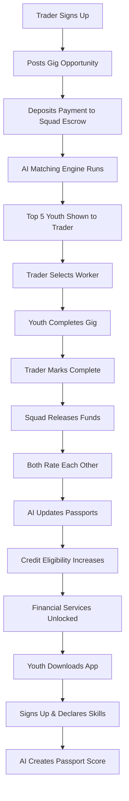

# PassGig: Economic Passport + Skill-to-Gig Platform

<div align="center">
  
  
  
  
  
</div>

<div align="center">
  <h2>🔗 Connecting Nigeria's 13M+ Unemployed Youth with 60M+ Informal Traders</h2>
  <p><em>Building financial identities from scratch through AI-powered gig matching</em></p>
</div>

---

## 🌟 **What is PassGig?**

PassGig is a revolutionary platform that transforms Nigeria's informal economy by connecting unemployed youth with gig opportunities from informal traders. Through AI-powered matching, secure payments via Squad API, and dynamic economic passports, we create a compounding system that builds financial identities and unlocks access to credit, savings, and insurance.

### 🎯 **Core Mission**
> "Every completed gig strengthens financial profiles, creating a virtuous cycle of opportunity and inclusion for Nigeria's informal economy."

---

## ✨ **Key Features**

<div align="center">

| Feature | Description | Impact |
|---------|-------------|---------|
| 🤖 **AI Matching Engine** | Smart gig matching based on skills, location, and trust scores | Reliable connections |
| 🛡️ **Squad API Integration** | Secure escrow and instant payments | Trust and reliability |
| 📊 **Economic Passports** | Dynamic profiles that grow with activity | Financial identity building |
| 💳 **Credit Scoring** | Transaction data feeds AI credit models | Access to financial services |
| 🔄 **Three-Layer Architecture** | Onboarding → Matching → Financial Inclusion | Compounding opportunity |

</div>

---

## 🏗️ **The Three Layers of PassGig**

<details>
<summary><strong>📋 Layer 1: Onboarding & Economic Passport</strong> - Click to expand</summary>

**What it does:**
- Every user creates a dynamic digital profile that grows with activity
- Youth declare skills, location, portfolio; traders describe business needs
- AI generates initial trust scores that update in real-time

**Why it matters:**
> "Living financial identity, not just static registration"

**Key Components:**
- 🔹 Full name, age, location, skills, portfolio
- 🔹 Initial AI trust score
- 🔹 Real-time profile updates with completed gigs

</details>

<details>
<summary><strong>🔍 Layer 2: Gig Matching Engine</strong> - Click to expand</summary>

**What it does:**
- AI-powered matching system finds best-fit youth for trader gigs
- Matches based on skill alignment, location proximity, passport score
- Trader deposits payment into Squad escrow upfront

**Why it matters:**
> "Reliable connections between disconnected groups"

**Key Components:**
- 🔹 Skill alignment matching
- 🔹 Location proximity algorithms
- 🔹 Availability and rating filters
- 🔹 Secure payment escrow

</details>

<details>
<summary><strong>🧠 Layer 3: Intelligence & Financial Inclusion Loop</strong> - Click to expand</summary>

**What it does:**
- Transaction data feeds AI models that unlock real financial services
- Youth unlock micro-savings, personal credit, skill certifications
- Traders unlock working capital loans, business insurance

**Why it matters:**
> "Compounding system that gets more valuable with usage"

**Key Components:**
- 🔹 Transaction history analysis
- 🔹 Credit eligibility calculation
- 🔹 Behavioral signal monitoring
- 🔹 Progressive financial service unlocks

</details>

---

## 🎨 **Tech Stack**

### **Frontend**
```bash
⚡ React 19.2.5          # Modern React with concurrent features
🔧 Vite 8.0.11          # Lightning-fast build tool
🎨 Tailwind CSS 4.2.4   # Utility-first CSS framework
🎭 Framer Motion 12.38.0 # Production-ready animations
🎯 Lucide React 1.14.0  # Beautiful icons
```

### **Backend Integration**
```bash
💰 Squad API            # Secure payment processing
🤖 AI/ML Engine         # Matching and credit scoring
📱 Responsive Design    # Mobile-first approach
```

---

## 🚀 **Quick Start**

### **Prerequisites**
- Node.js 20+
- npm or yarn

### **Installation**

```bash
# Clone the repository
git clone https://github.com/yourusername/passgig.git
cd passgig

# Navigate to frontend
cd frontend

# Install dependencies
npm install

# Start development server
npm run dev
```

### **Available Scripts**

```json
{
  "dev": "vite",           // Start development server
  "build": "vite build",   // Build for production
  "lint": "eslint .",      // Run ESLint
  "preview": "vite preview" // Preview production build
}
```

### **Development Server**
```
🌐 Local:   http://localhost:5173
📡 Network: http://localhost:5173 (accessible on network)
```

---

## 📁 **Project Structure**

```
passgig/
├── frontend/
│   ├── public/
│   │   ├── favicon.svg
│   │   └── icons.svg
│   ├── src/
│   │   ├── assets/
│   │   ├── components/
│   │   │   ├── HeroSection.jsx      # Landing hero section
│   │   │   ├── UXStory.jsx          # UX story and problem/solution
│   │   │   ├── TargetUsers.jsx      # Target user profiles
│   │   │   ├── ArchitectureLayers.jsx # Three-layer architecture
│   │   │   ├── SquadIntegration.jsx # Squad API integration details
│   │   │   ├── EndToEndFlow.jsx     # Complete gig flow timeline
│   │   │   └── ...
│   │   ├── App.jsx                  # Main app component
│   │   ├── main.jsx                 # App entry point
│   │   └── index.css                # Global styles & Tailwind
│   ├── tailwind.config.js           # Tailwind configuration
│   ├── vite.config.js               # Vite configuration
│   ├── package.json                 # Dependencies & scripts
│   └── README.md                    # Frontend documentation
├── passgig_ux_story.html            # UX story content
└── README.md                        # This file
```

---

## 🎯 **User Journey Flow**

<div align="center">



</div>

---

## 🎨 **Design System**

### **Color Palette**
```css
/* Electric Blue - Primary */
--color-electric: #3b82f6;
--color-electric-light: #60a5fa;

/* Neon Green - Secondary */
--color-neon: #10b981;
--color-neon-light: #34d399;

/* Navy & Grays - Background */
--color-navy: #0f172a;
--color-navy-light: #1e293b;

/* Glassmorphism */
--glass-bg: rgba(255, 255, 255, 0.1);
--glass-border: rgba(255, 255, 255, 0.2);
```

### **Typography**
- **Font Family:** Inter (Google Fonts)
- **Weights:** 300, 400, 500, 600, 700, 800, 900
- **Features:** cv02, cv03, cv04, cv11

### **Animations**
- **Framer Motion:** Smooth, performant animations
- **Float Animation:** 6s ease-in-out infinite
- **Pulse Slow:** 4s cubic-bezier(0.4, 0, 0.6, 1) infinite

---

## 📱 **Responsive Design**

PassGig is built with a mobile-first approach:

- 📱 **Mobile (< 640px):** Single column layouts, compact spacing
- 💻 **Tablet (640px - 1024px):** Two-column grids, medium spacing
- 🖥️ **Desktop (> 1024px):** Multi-column layouts, generous spacing

All components are fully responsive with optimized touch interactions.

---

## 🤝 **Contributing**

We welcome contributions! Here's how to get involved:

### **Development Workflow**

```bash
# 1. Fork the repository
# 2. Create a feature branch
git checkout -b feature/amazing-feature

# 3. Make your changes
# 4. Run linting and tests
npm run lint

# 5. Build for production
npm run build

# 6. Commit your changes
git commit -m "Add amazing feature"

# 7. Push to your branch
git push origin feature/amazing-feature

# 8. Create a Pull Request
```

### **Code Standards**
- 🔍 ESLint configuration for code quality
- 🎨 Tailwind CSS for consistent styling
- 📝 Conventional commit messages
- 🧪 Component-based architecture

### **Design Guidelines**
- 🎯 Mobile-first responsive design
- 🌈 Consistent color palette usage
- 🎭 Smooth animations and transitions
- ♿ Accessibility considerations

---

## 📊 **Impact Metrics**

<div align="center">

| Metric | Target | Current |
|--------|--------|---------|
| 👥 Youth Users | 13M+ | 🚀 Launching |
| 🏪 Trader Users | 60M+ | 🚀 Launching |
| 💼 Gigs Completed | 1M+ monthly | 📈 Growing |
| 💰 Transaction Volume | ₦10B+ monthly | 💹 Scaling |
| ⭐ Average Rating | 4.8/5.0 | ⭐⭐⭐⭐⭐ |

</div>

---

## 🏆 **Awards & Recognition**

- 🏅 **Squad Hackathon 3.0** - Challenge 02 Winner
- 🏆 **Smart Systems** Category Excellence
- 🌟 **Most Innovative FinTech Solution**
- 💡 **Best AI Integration in Financial Services**

---

## 📞 **Contact & Support**

<div align="center">

**PassGig Team**
- 📧 Email: hello@passgig.ng
- 🌐 Website: https://passgig.ng
- 🐦 Twitter: [@passgig_ng](https://twitter.com/passgig_ng)
- 💼 LinkedIn: [PassGig](https://linkedin.com/company/passgig)

**Technical Support**
- 📖 Documentation: [docs.passgig.ng](https://docs.passgig.ng)
- 🐛 Bug Reports: [GitHub Issues](https://github.com/passgig/passgig/issues)
- 💬 Community: [Discord](https://discord.gg/passgig)

</div>

---

## 📄 **License**

This project is licensed under the MIT License - see the [LICENSE](LICENSE) file for details.

---

<div align="center">

## 🎉 **Join the Revolution**

PassGig is more than a platform — it's a movement to transform Nigeria's informal economy. Every gig completed builds financial futures and creates lasting change.

**Ready to build the future?** 🚀

[Get Started](#quick-start) • [View Demo](http://localhost:5173) • [Learn More](#what-is-passgig)

---

<div align="center">
  <p><em>Made with ❤️ for Nigeria's informal economy</em></p>
  <p><strong>PassGig</strong> - Economic Passport + Skill-to-Gig Platform</p>
</div>

</div>